# Reconstruction of MNIST and ShapeNetCore

The encoder is the `encoder_sparse` and the rendered model is the point
cloud optimization rendering (a non-parametric method). The latter
clearly outperforms all models.

| dataset | Airplane |  | Car |  | Chair |  | Mnist |  |
|----|----|----|----|----|----|----|----|----|
|  | MMD-CD | MMD-EMD | MMD-CD | MMD-EMD | MMD-CD | MMD-EMD | MMD-CD | MMD-EMD |
|  | mean | mean | mean | mean | mean | mean | mean | mean |
| model |  |  |  |  |  |  |  |  |
| Ect-128 | 3.382390 | 0.466779 | 6.221755 | 0.845426 | 5.716591 | 0.821442 | NaN | NaN |
| Ect-256 | 0.316157 | 0.116938 | 0.889835 | 0.273740 | 0.683799 | 0.221733 | NaN | NaN |
| Ect-64 | 6.810036 | 0.965796 | 9.268112 | 1.347526 | 21.936062 | 2.929956 | NaN | NaN |
| Encoder | 1.486651 | 6.064259 | 5.904585 | 4.444335 | 9.419030 | 7.773450 | 41.341307 | 11.577831 |
| Encoder Chamfer | 0.978317 | 9.759554 | 6.043088 | 13.437557 | 9.774287 | 24.118090 | NaN | NaN |
| Encoder Downsample | 2.365263 | 26.006261 | 11.392715 | 41.941542 | 16.051830 | 75.206883 | 159.988590 | 221.338034 |
| Encoder Ect | 2.413157 | 1.088348 | 7.749730 | 2.471831 | 13.056453 | 4.289896 | NaN | NaN |

# Model outputs

## MNIST

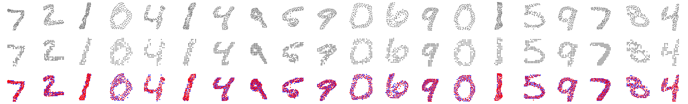

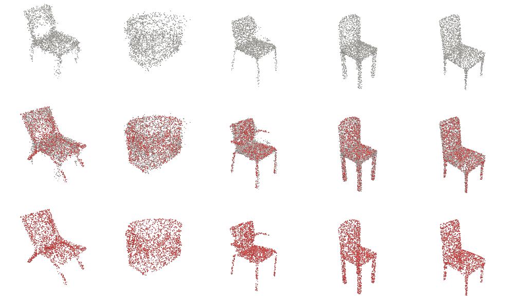

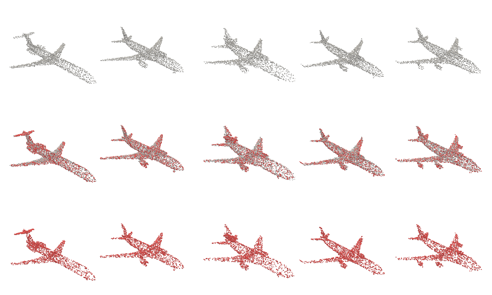

## CNN Encoder Chair

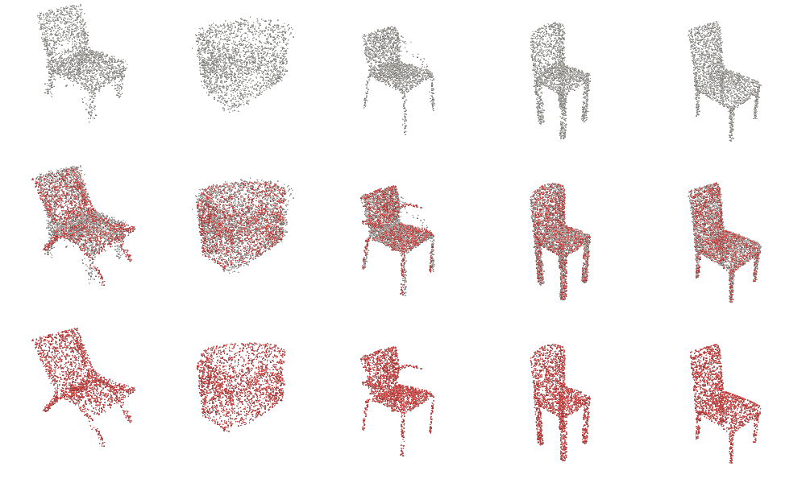

## CNN Encoder Chair

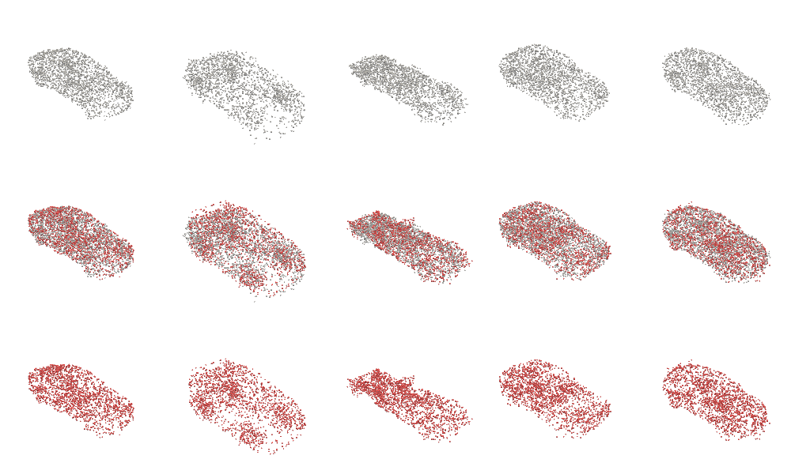

# Encoder with ECT loss

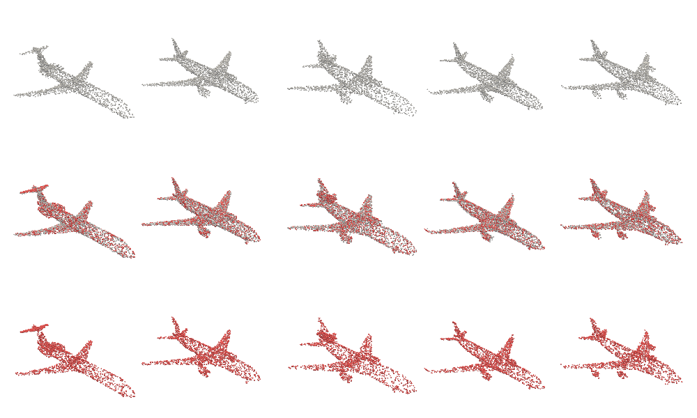

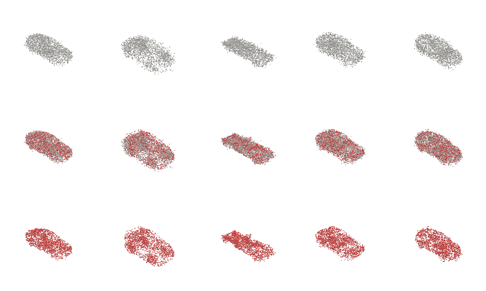

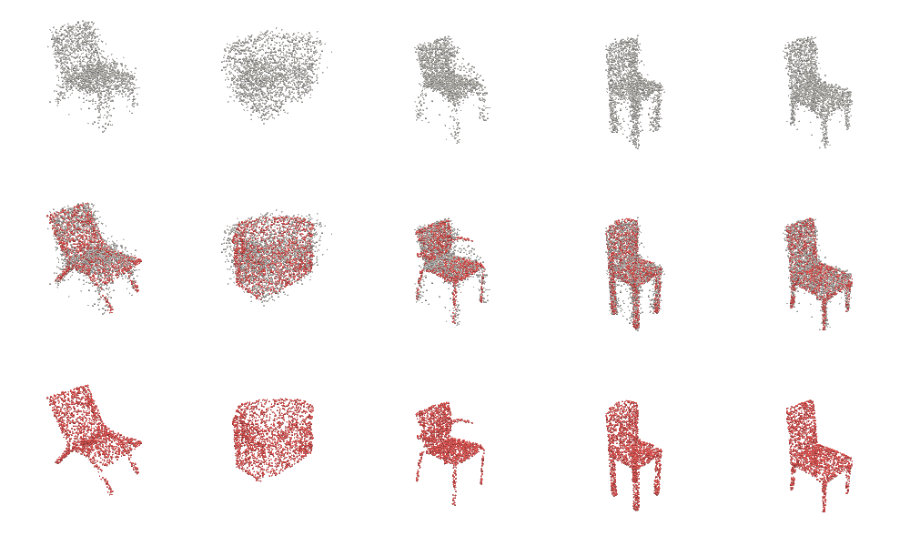

## CNN Encoder Airplane

## ECT-64

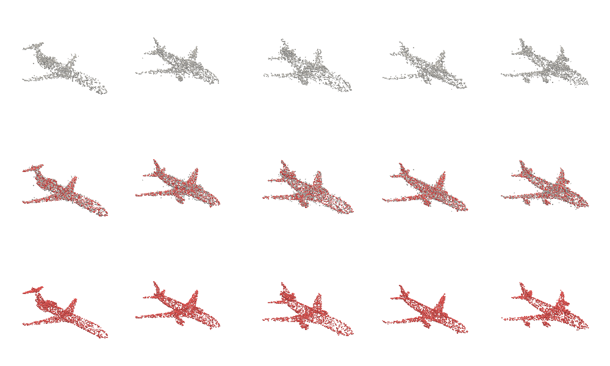

# Downsample Airplane

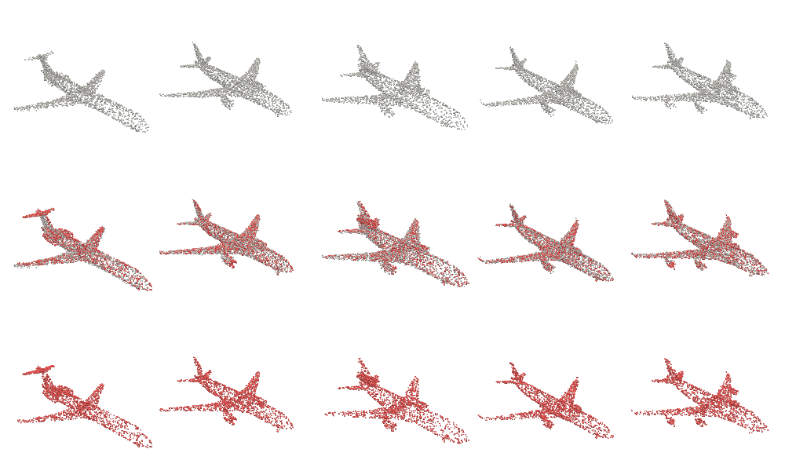

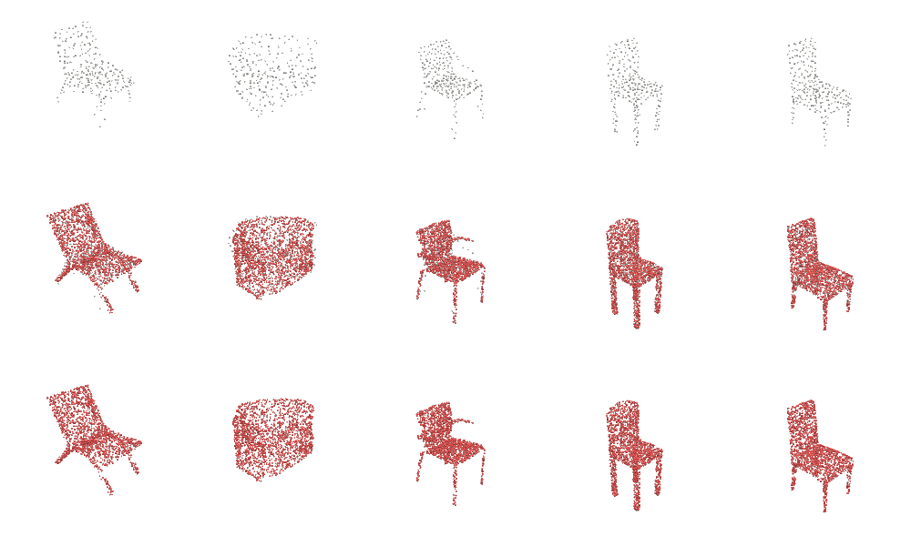
