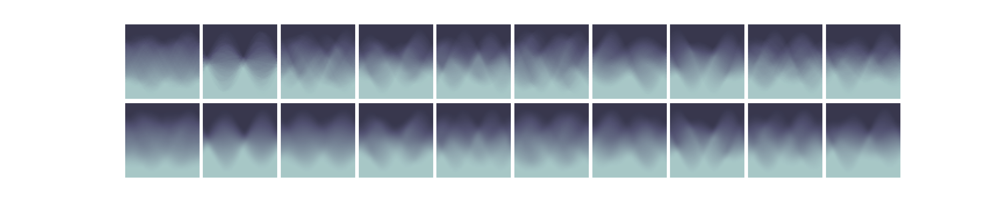

```{note}
This is a note
```

# Topological Reconstruction and Interpolation of Graphs and Point Clouds

The Euler Characteristic Transform is an expressive and fast to compute.
However inversion of Euler Characteristic Transforms has hitherto only focussed
on specialized cases, such as grayscale images and theoretical treatises for
graphs in 2D.

We propose a machine learning based approach for the inversion of ECT's of
shapes in two and three dimensions. Using a structured approach in choosing the
directions, we find that machine learning algorithms can capture the essence of
shapes through the ECT.

By training a Variational Autoencoder to reconstruct the Euler Characteristic
transform to a $64$ dimensional latent space. This construction allows us to
compress a pointcloud of $1024$ points in 3D to a $64$ dimensional latent
vector and reconstruct the original point cloud from it. In the top row of the
ECT's we find the original ECT's and below it the reconstructed ECT's using our
VAE.

<!--

-->

We then pass each ECT through our decoder model obtain the following
reconstructed point clouds.

<!--
 -->

Moreover, we are able to _sample_ from this latent space to obtain novel
_generated_ Euler Characteristic transforms which in turn can be decoded using
our trained decoding model.

<!--

-->

<!-- 
-->

# MNIST

## Reconstruction results
Results for the MNIST dataset. 

First we reconstruct the numbers 0-9 from the ect to a point cloud. 
The top row is the reconstruction and the bottom row the input ect. 


Next we test how well the Variational Auto Encoder is able to reconstruct the 
ECT. The top row represents the original ECT (same as bottom row above) and the 
bottom row is the reconstructed ECT.



Once we are confident in the VAE's ability to faithfully reconstruct ect's, we 
need to verify that the reconstructed ect also provides good input for the model 
prediction since they got trained separately. 
The top row is the original data, the second row the reconstruction from the 
encoder model and third row the reconstruction of the point with the ect passed 
through vae first. 
The blurring, native to VAE's, causes for instance the 0 and 2 to be confused. 


The VAE also allow us to sample from the 64 dimensional latent space and obtain 
generated ECT's. These generated ect's then get passed through our decoder model 
to finally obtain plausable reconstructions of point clouds. 


## Emperical stability
### Noisy pointclouds
We check how stable the encoder model is with respect to adding normally distributed
noise to the point cloud. In the top left we find the original ground truth with 
the corresponding ect in the bottom row. In the middle row we have the reconstruction 
result for the computed ect. 


### Noisy ECT
In this experiment we test how stable the ect is with respect to normally distributed 
noise in the ect domain.
From left to right we repeatedly add normally distributed noise with std of .05.
Then we pass the noisy ect through our decoder plot both the ect and the 
predicted point clouds. 
The top row are the reconstructed pointcloud corresponding to the bottom noisy 
ect. The left most ect has no noise. 


## Modelnet
### Reconstructed modelnet


### Reconstructed vae modelnet


### Generated vae modelnet


## DSprites

### Reconstructed Dsprites


### Reconstructed VAE


### Reconstructed Dsprites


## Topological 
### Reconstructed pointclouds


### Reconstructed VAE Pointcloud


### Generated ECT & Pointcloud


# Reproducibility

The models used to generate the results and tables in the our work are released 
as pytorch lightning models in the release section of the repository.
